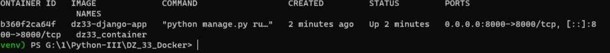
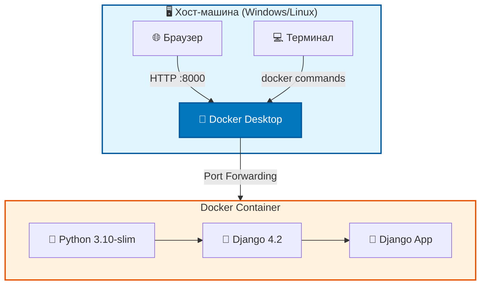
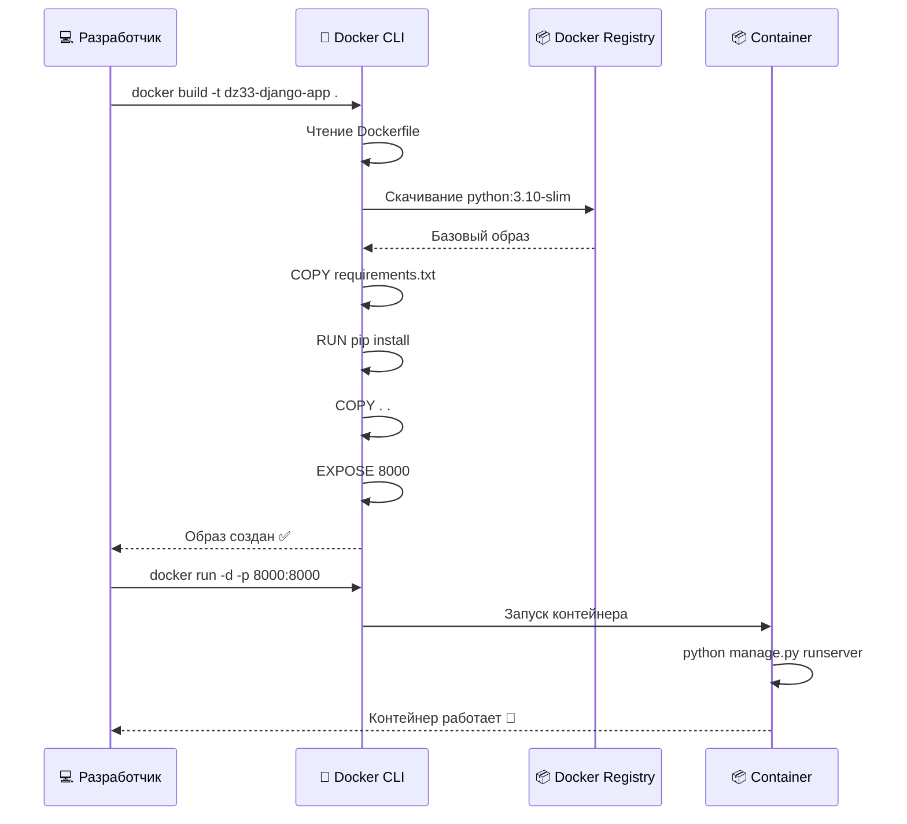
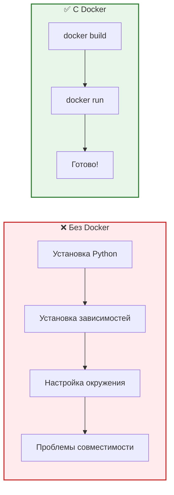
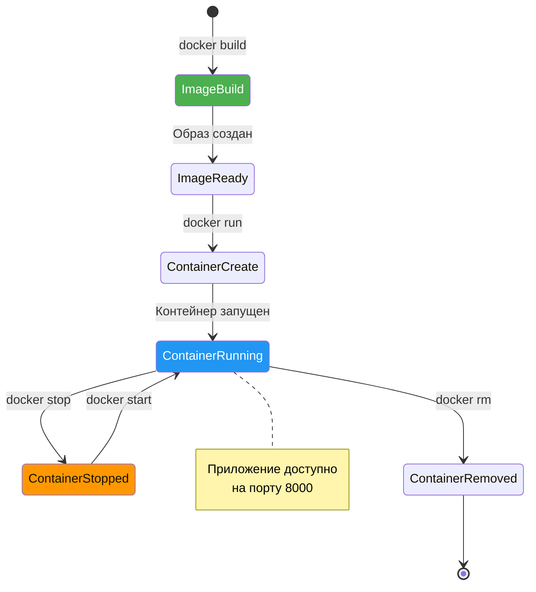

# 🐳 DZ33 — Docker: Контейнеризация Django-приложения


**Автор:** Виктор Куличенко  
**Занятие:** #33 — Docker контейнеры. Создание контейнеров для web-приложений  
**Статус:** ✅ Завершено

---

## 📌 О проекте

В рамках данного задания был разработан и настроен `Dockerfile` для контейнеризации веб-приложения на Django. Проект демонстрирует базовые принципы работы с Docker: создание образа, управление портами и запуск изолированного контейнера.

### 🎯 Выполненные задачи:
- ✅ Написан оптимизированный `Dockerfile` на базе `python:3.10-slim`
- ✅ Настроен `.dockerignore` для исключения лишних файлов из образа
- ✅ Образ успешно собран и контейнер запущен
- ✅ Приложение доступно по проброшенному порту

---

## 🚀 Быстрый старт

### 1. Сборка образа
```bash
docker build -t dz33-django-app .
``` 

### 2. Запуск контейнера
```bash
docker run -d -p 8000:8000 --name dz33_container dz33-django-app
```  

### 3. Проверка работы
Откройте в браузере: **http://127.0.0.1:8000**

### 4. Остановка и удаление контейнера
```bash
docker stop dz33_container
docker rm dz33_container
``` 

---

## 📸 Демонстрация работы

### 1. Статус контейнера (docker ps -a)

*Контейнер успешно запущен и работает в фоновом режиме (статус Up).*

### 2. Работающее Django-приложение

*Веб-приложение Django успешно отвечает на запросы через проброшенный порт 8000.*

---

## 📂 Структура проекта

``` text

DZ_33_Docker/
├── myproject/          # Исходный код Django-проекта
│   ├── manage.py
│   └── myproject/
├── docs/
│   └── screenshots/    # Скриншоты для отчета
├── .dockerignore       # Исключения для Docker
├── Dockerfile          # Инструкции для сборки образа
├── requirements.txt    # Зависимости Python
└── README.md           # Этот файл
```
---
1. Архитектура контейнеризации



2. Поток сборки и запуска контейнера

3. Структура Dockerfile (пошагово)

``` mermaid
flowchart LR
    A["FROM<br/>python:3.10-slim"] --> B["ENV<br/>PYTHONDONTWRITEBYTECODE=1<br/>PYTHONUNBUFFERED=1"]
    B --> C["WORKDIR<br/>/app"]
    C --> D["COPY<br/>requirements.txt"]
    D --> E["RUN<br/>pip install"]
    E --> F["COPY<br/>. ."]
    F --> G["EXPOSE<br/>8000"]
    G --> H["CMD<br/>python manage.py runserver"]
    
    style A fill:#4CAF50,stroke:#2E7D32,stroke-width:2px,color:#fff
    style B fill:#2196F3,stroke:#1565C0,stroke-width:2px,color:#fff
    style C fill:#FF9800,stroke:#E65100,stroke-width:2px,color:#fff
    style D fill:#9C27B0,stroke:#6A1B9A,stroke-width:2px,color:#fff
    style E fill:#F44336,stroke:#C62828,stroke-width:2px,color:#fff
    style F fill:#00BCD4,stroke:#00838F,stroke-width:2px,color:#fff
    style G fill:#FFC107,stroke:#FF8F00,stroke-width:2px
    style H fill:#795548,stroke:#4E342E,stroke-width:2px,color:#fff
```


4. Сравнение: Без Docker vs С Docker


5. Жизненный цикл контейнера


## 🏗️ Архитектура проекта

### 1. Архитектура контейнеризации

```mermaid
graph TB
    subgraph Host["🖥️ Хост-машина (Windows/Linux)"]
        Browser[🌐 Браузер]
        Docker["🐳 Docker Desktop"]
        Terminal[💻 Терминал]
    end
    
    subgraph Container["📦 Docker Container"]
        Python["🐍 Python 3.10-slim"]
        Django[" Django 4.2"]
        App["🚀 Django App"]
    end
    
    Browser -->|HTTP :8000| Docker
    Docker -->|Port Forwarding| Container
    Terminal -->|docker commands| Docker
    Python --> Django
    Django --> App
    
    style Host fill:#e1f5fe,stroke:#01579b,stroke-width:2px
    style Container fill:#fff3e0,stroke:#e65100,stroke-width:2px
    style Docker fill:#0277bd,stroke:#01579b,stroke-width:2px,color:#fff
 ```
 ---

##  2. Поток сборки и запуска


```-mermaid


🗄️ Базы данных схемы (SQLAlchemy модели):
Находятся в файле models.py:
User - таблица пользователей
Product - таблица товаров
Order - таблица заказов
```
``` mermaid
  erDiagram
    USERS ||--o{ ORDERS : places
    PRODUCTS ||--o{ ORDERS : contains
    
    USERS {
        int id PK
        string username UK
        string email UK
        string hashed_password
        boolean is_admin
    }
    
    PRODUCTS {
        int id PK
        string name
        string description
        float price
        string image_url
    }
    
    ORDERS {
        int id PK
        int user_id FK
        int product_id FK
        int quantity
        string status
    }
erDiagram
    USERS ||--o{ ORDERS : places
    PRODUCTS ||--o{ ORDERS : contains
    
    USERS {
        int id PK
        string username UK
        string email UK
        string hashed_password
        boolean is_admin
    }
    
    PRODUCTS {
        int id PK
        string name
        string description
        float price
        string image_url
    }
    
    ORDERS {
        int id PK
        int user_id FK
        int product_id FK
        int quantity
        string status
    }
```


## 🔍 Анализ Dockerfile

| Директива | Назначение |
|-----------|------------|
| FROM python:3.10-slim | Использование легковесного официального образа |
| ENV PYTHONDONTWRITEBYTECODE=1 | Запрет создания .pyc файлов |
| ENV PYTHONUNBUFFERED=1 | Вывод логов Python напрямую в консоль Docker |
| WORKDIR /app | Установка рабочей директории внутри контейнера |
| COPY requirements.txt . | Копирование файла зависимостей |
| RUN pip install ... | Установка зависимостей в образ |
| COPY . . | Копирование исходного кода проекта |
| EXPOSE 8000 | Документирование используемого порта |
| CMD [...] | Команда по умолчанию для запуска контейнера |


## 👤 Автор

**Viktor Kulichenko**  
*Software Engineer / Information Security Specialist*  
[GitHub](https://github.com/VictorKVS)


*© 2026 Виктор Куличенко. Проект выполнен в рамках курса "Python-разработчик I".*